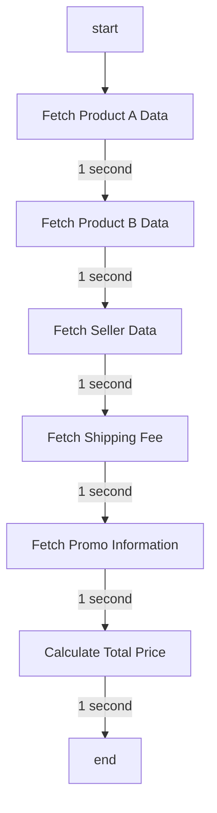
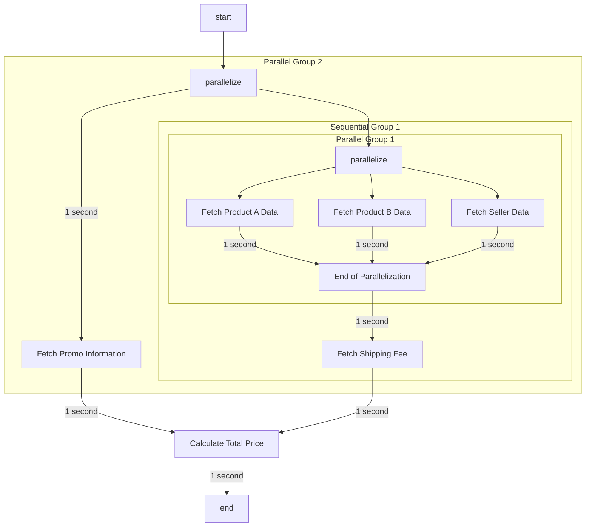

# Parallelization

## Background

Ever wondered why your app server/worker takes long time? In some cases, it's caused by "slow" dependencies. If the dependencies are in your control, you can try to optimize the latency in dependencies sides. 

However, What if you don't have the control and it's beyond your scope to optimize the dependencies? What's the most feasible way to optimize your app latency from only your app scope?

## Case: Calculate Total Price in Marketplace Purchase

Imagine your app is a backend component in Marketplace to calculate total price of a purchase from a seller. 

### Assumptions
- Buyer buy Product A and Product B from same seller
- Shipping Fee can be combined for two products
- Buyer needs to pay some taxes
- Buyer have a promo code, so that they can have a discount! To simplify, let say the discount is flat!


This is how your app flow will generally work:


Notes:
- To Fetch Product Data, the app will need `product_id`
- To Fetch Seller Data, the app will need `product_id`
- To Fetch Shipping Fee, the app will need `product data` and `seller data` fetched from `Process 1`, `Process 2`, and `Process 3`.
- To Fetch Promo Information, the app will need `promo_code`
- Formula: Total Price = Product A Price + Product B Price + Shipping Fee + Tax Fee - Promo Code 


> Overall app latency will take 5 seconds! :smiling_face_with_tear:

How can we do to improve the overall latency from our App scope? :thinking:

### Key concerns
1. Does the order of all task execution matters? 
2. Can we swap the order of execution between any process and the other Process?
3. If not, which process the order of execution really matters

### Analysis
The order of executions that really matters:
1. `Process 4` must be executed after `Process 1`, `Process 2`, and `Process 3`
2. `Process 6` must be executed after other Processes.

The order of executions of other processes can be swapped.

### Proposal: Make it Parallel!
> Steps: 
> - Group the processes into the same group if the ordering don't really matters -> Let's call it Parallel group
> - Group the processes into the same group if the ordering really matters. -> Let's call it Sequential group

From above rule, we can have these list of groups
1. Parallel Group 1, consists of: `Process 1`, `Process 2`, `Process 3`
2. Sequential Group 1, consists of: `Parallel Group 1` and `Process 4`
3. Parallel Group 2, consists of: `Sequential Group 1` and `Process 5`
4. Sequential Group 2, consists of: `Parallel Group 2` and `Process 6`


Hence, we can have the app to work like this


## Benchmark
### Sequential Function 
Elapsed time 5.279 seconds 🐢🐢🐢
```sh
go test -timeout 300s -run ^TestCalculateTotalPrice_Sequential$ github.com/zhorifiandi/golearn/parallelization -v

=== RUN   TestCalculateTotalPrice_Sequential
2024/09/17 15:56:49 Product A data fetched
2024/09/17 15:56:50 Product B data fetched
2024/09/17 15:56:51 Seller data fetched
2024/09/17 15:56:52 Shipping fee fetched
2024/09/17 15:56:53 Promo information fetched
2024/09/17 15:56:53 Total Price: 155
    /Users/arizho/CODEPERSONAL/golearn/parallelization/run-all_test.go:16: Elapsed time: 5.007204791s
--- PASS: TestCalculateTotalPrice_Sequential (5.01s)
PASS
ok  	github.com/zhorifiandi/golearn/parallelization	5.279s
```

### Parallelized Function 
Elapsed time 2 seconds. Much Fasteer!!! 🚀🚀🚀🚀🚀
```sh
go test -timeout 300s -run ^TestCalculateTotalPrice_Parallelized$ github.com/zhorifiandi/golearn/parallelization -v

=== RUN   TestCalculateTotalPrice_Parallelized
2024/09/17 15:56:17 Promo information fetched
2024/09/17 15:56:17 Product A data fetched
2024/09/17 15:56:17 Product B data fetched
2024/09/17 15:56:17 Seller data fetched
2024/09/17 15:56:18 Shipping fee fetched
2024/09/17 15:56:18 Total Price: 155
    /Users/arizho/CODEPERSONAL/golearn/parallelization/run-all_test.go:24: Elapsed time: 2.0042865s
--- PASS: TestCalculateTotalPrice_Parallelized (2.00s)
PASS
ok  	github.com/zhorifiandi/golearn/parallelization	(cached)
```

