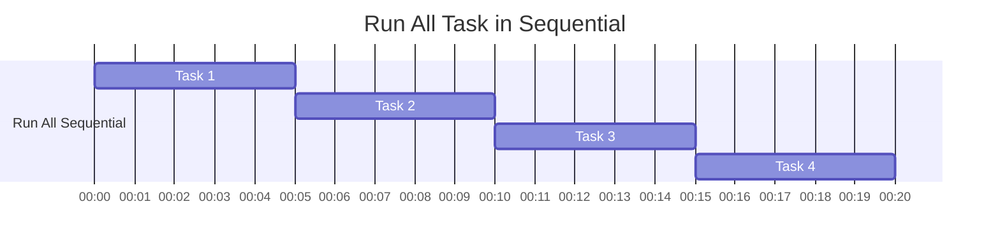
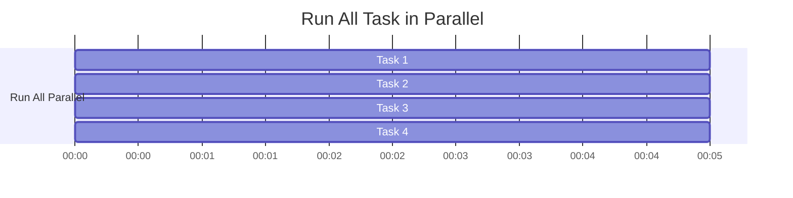

# Parallelize


Instead of running it sequentially


Try to parallelize it!



Instead of running it sequentially

```go
func RunAllSequential(numOfProcess int, processingTime uint) time.Duration {
	start := time.Now()

	for i := 1; i <= numOfProcess; i++ {
		ExecuteMockProcess(processingTime)
	}

	return time.Since(start)
}
```

Try to parallelize it! Leverage
- Goroutines
- Wait Group

```go
func RunAllParallel(numOfProcess int, processingTime uint) time.Duration {
	start := time.Now()

	var wg sync.WaitGroup

	for i := 1; i <= numOfProcess; i++ {
		wg.Add(1)
		go func() {
			defer wg.Done()
			ExecuteMockProcess(processingTime)
		}()
	}

	wg.Wait()
	return time.Since(start)
}

```